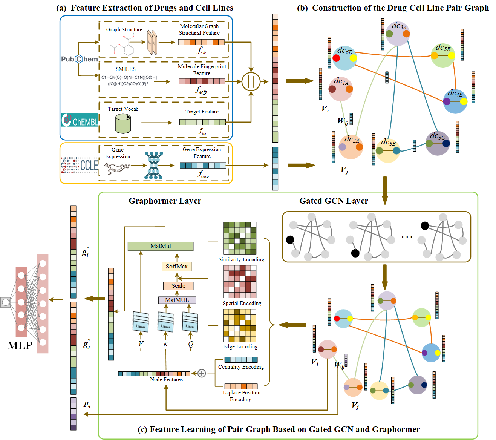

# SDCGDCP

## Welcome to SDCGDCP
**SDCGDCP (Synergistic Drug Combination Prediction via Graphormer and Drug-Cell Line Pair Graph)** This study proposes SDCGDCP, a model for predicting drug combination synergy. It integrates multiple data types—drug structures, target activity, and cell line gene expression—to construct a comprehensive drug-cell line graph. The model utilizes a GatedGCN module and incorporates five structural encodings, followed by the Graphormer to capture complex network relationships. SDCGDCP demonstrated superior performance, achieving state-of-the-art results (AUROC: 0.923, AUPRC: 0.885) on the DrugCombDB dataset, with its effectiveness validated through ablation studies and case analyses.

The flow chart of SDCGDCP is as follows:



## Directory Structure

```markdown
├── Datasets
│   ├── features
│   │   ├── Gene.csv           
│   │   ├── Target.csv            
│   │   ├── ECFP.csv            
│   │   └── Graph.csv             
│   └── samples					  
│       └── samples.csv            
├── config.py                     
├── data_preprocess.py                       
├── functional.py                            
├── layers.py                      
├── main.py                      
├── model.py                      
├── train_eval.py                      
└── utils.py                     


## Installation and Requirements

SDCGDCP has been tested in a Python 3.9 environment. It is recommended to use the same library versions as specified. Using a conda virtual environment is also recommended to avoid affecting other parts of the system. Please follow the steps below.

Key libraries and versions:

```markdown
├── torch              1.12.0+cu113
├── torch-geometric    2.5.3
├── torch-scatter      2.1.1
├── torch-sparse       0.6.18
├── networkx           3.2.1
├── scikit-learn       1.4.2
├── pandas             1.2.4
├── matplotlib         3.4.3
└── numpy              1.26.4        
```

### Step 1: Download Code and Data

Use the following command to download this project or download the zip file from the "Code" section at the top right:

```bash
git init 
git clone https://github.com/Philosopher-Zhao/SDCGDCP.git
```

### Step 2: Run the Model

Run the main script in the virtual environment:

```bash
python main.py
```

All results of the operation will be saved in the current directory.

## Citation 

If you use our tool and code, please cite our article and mark the project to show your support，thank you!

Citation format: 

Yuchen Zhang, Bingzhe Zhao, Zhuoqun Fu, Yiming Han, Beidan Liu and Xiujuan Lei, "Synergistic Drug Combination Prediction via Graphormer and Drug-Cell Line Pair Graph," 2025 IEEE International Conference on Bioinformatics and Biomedicine (BIBM), Wuhan, China, 2025.

Paper Link:
